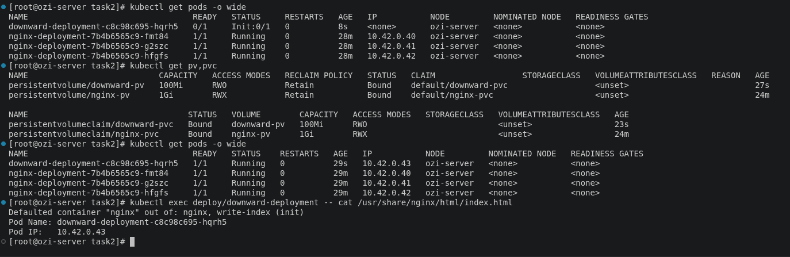

# Lab 4 — Part 2: Downward API

> **Topics covered:** Downward API · PersistentVolume · PersistentVolumeClaim · InitContainer · podIP · podName

---

## Overview

This lab uses the Kubernetes **Downward API** to expose pod metadata (`podIP` and `podName`) as environment variables inside a container. An `initContainer` reads those values and writes them into `index.html` before Nginx starts, so the file is served with live pod information.

---

## Architecture

```
hostPath (/data/downward)
        │
        ▼
  PV: downward-pv
        │
        ▼
  PVC: downward-pvc
        │
        ▼
  Deployment
  ┌─────────────────────────────────┐
  │  initContainer (busybox)        │  ← writes podIP + podName to index.html
  │         │                       │
  │         ▼                       │
  │  container: nginx               │  ← serves index.html
  └─────────────────────────────────┘
```

---

## Step 2a — Prepare the hostPath on the Node

```bash
# Create the directory
sudo mkdir -p /data/downward

# Verify
ls /data/downward
```

---

## Step 2a — Create the PersistentVolume

**File: `downward-pv.yaml`**

```yaml
apiVersion: v1
kind: PersistentVolume
metadata:
  name: downward-pv
spec:
  capacity:
    storage: 100Mi
  accessModes:
    - ReadWriteOnce
  persistentVolumeReclaimPolicy: Retain
  storageClassName: ""       # disables dynamic provisioning
  hostPath:
    path: /data/downward
```

```bash
kubectl apply -f downward-pv.yaml
```

---

## Step 2b — Create the PersistentVolumeClaim

**File: `downward-pvc.yaml`**

```yaml
apiVersion: v1
kind: PersistentVolumeClaim
metadata:
  name: downward-pvc
spec:
  accessModes:
    - ReadWriteOnce
  resources:
    requests:
      storage: 100Mi
  storageClassName: ""       # must match the PV
  volumeName: downward-pv    # explicit static binding
```

```bash
kubectl apply -f downward-pvc.yaml

# Both should show STATUS = Bound
kubectl get pv,pvc
```

---

## Step 2c — Create the Deployment

**File: `downward-deployment.yaml`**

> The `initContainer` runs before Nginx starts. It reads `POD_NAME` and `POD_IP` from the Downward API environment variables and writes them into `index.html` on the shared volume. When Nginx starts, it serves that file.

```yaml
apiVersion: apps/v1
kind: Deployment
metadata:
  name: downward-deployment
spec:
  replicas: 1
  selector:
    matchLabels:
      app: downward-nginx
  template:
    metadata:
      labels:
        app: downward-nginx
    spec:
      initContainers:
        - name: write-index
          image: busybox
          command:
            - sh
            - -c
            - |
              echo "Pod Name: $POD_NAME" >  /web/index.html
              echo "Pod IP:   $POD_IP"   >> /web/index.html
          env:
            - name: POD_NAME
              valueFrom:
                fieldRef:
                  fieldPath: metadata.name      # Downward API: pod name
            - name: POD_IP
              valueFrom:
                fieldRef:
                  fieldPath: status.podIP       # Downward API: pod IP
          volumeMounts:
            - name: web-content
              mountPath: /web
      containers:
        - name: nginx
          image: nginx:alpine
          volumeMounts:
            - name: web-content
              mountPath: /usr/share/nginx/html
      volumes:
        - name: web-content
          persistentVolumeClaim:
            claimName: downward-pvc
```

```bash
kubectl apply -f downward-deployment.yaml
```

---

## Verification

```bash
# Check pod is Running
kubectl get pods -o wide

# Get the pod name
kubectl get pods

# Read index.html — should show the pod name and IP
kubectl exec deploy/downward-deployment -- cat /usr/share/nginx/html/index.html
```

**Expected output:**

---

---

```
Pod Name: downward-deployment-<hash>
Pod IP:   10.x.x.x
```

```bash
# Optional: curl the Nginx service to confirm it is served over HTTP
kubectl expose deployment downward-deployment --port=80 --type=NodePort
curl http://<node-ip>:<node-port>
```

---

## Verification Checklist

| Check | Command | Expected Result |
|---|---|---|
| PV bound | `kubectl get pv downward-pv` | `STATUS = Bound` |
| PVC bound | `kubectl get pvc downward-pvc` | `STATUS = Bound` |
| Pod running | `kubectl get pods` | `1/1 Running` |
| index.html has pod name | `kubectl exec deploy/downward-deployment -- cat /usr/share/nginx/html/index.html` | `Pod Name: downward-deployment-xxxx` |
| index.html has pod IP | same command above | `Pod IP: 10.x.x.x` |
| initContainer completed | `kubectl describe pod <pod>` | `initContainer write-index` state = `Terminated (Completed)` |

---

## Key Concepts

| Concept | Explanation |
|---|---|
| **Downward API** | Exposes pod metadata (name, IP, namespace, labels, etc.) to containers via environment variables or volume files — without needing to call the Kubernetes API. |
| `fieldRef` | The mechanism used inside `env` to reference a pod field from the Downward API. |
| `metadata.name` | Resolves to the full pod name at runtime (e.g. `downward-deployment-5d9f7b-xkqpl`). |
| `status.podIP` | Resolves to the IP address assigned to the pod by the cluster network. |
| **initContainer** | Runs to completion before any main containers start. Used here to write `index.html` with live pod data before Nginx serves it. |
| **Shared volume** | Both the `initContainer` and the `nginx` container mount the same PVC, so the file written by init is immediately available to Nginx. |

---

## How the Downward API Works

```
Kubernetes API
      │
      │  injects at pod startup
      ▼
  Environment Variables
  ┌──────────────────────────────┐
  │  POD_NAME = metadata.name   │
  │  POD_IP   = status.podIP    │
  └──────────────────────────────┘
            │
            │  read by initContainer (busybox sh)
            ▼
      /web/index.html
  ┌──────────────────────────────┐
  │  Pod Name: downward-xxx      │
  │  Pod IP:   10.x.x.x          │
  └──────────────────────────────┘
            │
            │  served by nginx
            ▼
        HTTP response
```