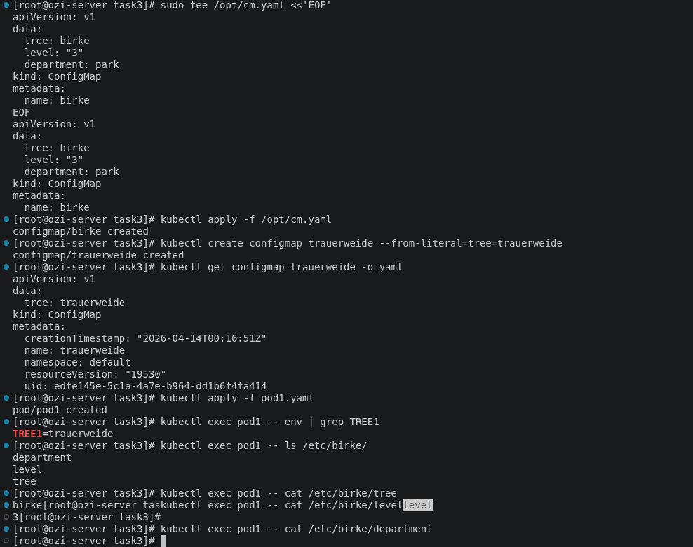

# Lab 4 — Part 3: ConfigMaps

> **Topics covered:** ConfigMap · env variable from ConfigMap · Volume mount from ConfigMap · kubectl create configmap · kubectl apply -f

---

## Overview

This lab creates two ConfigMaps using different methods, then creates a Pod that:
- Exposes one ConfigMap key as an **environment variable**
- Mounts all keys of another ConfigMap as **files under `/etc/birke/`**

---

## Architecture

```
ConfigMap: trauerweide          ConfigMap: birke
  tree = trauerweide              tree = birke
                                  level = 3
                                  department = park
       │                                │
       │ env var                        │ volume mount
       ▼                                ▼
  Pod: pod1 (nginx:alpine)
  ┌─────────────────────────────────────────┐
  │  ENV: TREE1 = trauerweide              │
  │                                         │
  │  /etc/birke/tree        → birke         │
  │  /etc/birke/level       → 3             │
  │  /etc/birke/department  → park          │
  └─────────────────────────────────────────┘
```

---

## Step 3a — Create ConfigMap `birke` from file

Create the file at `/opt/cm.yaml` on your system:

```bash
sudo tee /opt/cm.yaml <<'EOF'
apiVersion: v1
data:
  tree: birke
  level: "3"
  department: park
kind: ConfigMap
metadata:
  name: birke
EOF
```

Apply it:

```bash
kubectl apply -f /opt/cm.yaml

# Verify
kubectl get configmap birke
kubectl describe configmap birke
```

**Expected output of describe:**

```
Name:         birke
Data
====
department:   park
level:        3
tree:         birke
```

---

## Step 3b — Create ConfigMap `trauerweide` from literal

```bash
kubectl create configmap trauerweide --from-literal=tree=trauerweide

# Verify
kubectl get configmap trauerweide
kubectl describe configmap trauerweide
```

**Expected output of describe:**

```
Name:         trauerweide
Data
====
tree:         trauerweide
```

---

## Step 3c — Create Pod `pod1`

**File: `pod1.yaml`**

```yaml
apiVersion: v1
kind: Pod
metadata:
  name: pod1
spec:
  containers:
    - name: nginx
      image: nginx:alpine
      env:
        - name: TREE1                   # environment variable name inside the pod
          valueFrom:
            configMapKeyRef:
              name: trauerweide         # ConfigMap name
              key: tree                 # key to read from that ConfigMap
      volumeMounts:
        - name: birke-vol
          mountPath: /etc/birke         # all keys mounted as files here
  volumes:
    - name: birke-vol
      configMap:
        name: birke                     # mount all keys of this ConfigMap
```

```bash
kubectl apply -f pod1.yaml

# Wait for pod to be Running
kubectl get pod pod1
```

---

## Verification

### Check environment variable TREE1

```bash
kubectl exec pod1 -- env | grep TREE1
```

**Expected output:**

```
TREE1=trauerweide
```

---

### Check files mounted under /etc/birke/

```bash
# List all files (one file per ConfigMap key)
kubectl exec pod1 -- ls /etc/birke/
```

**Expected output:**

```
department
level
tree
```

```bash
# Read each file
kubectl exec pod1 -- cat /etc/birke/tree
kubectl exec pod1 -- cat /etc/birke/level
kubectl exec pod1 -- cat /etc/birke/department
```

**Expected output:**

```
birke
3
park
```

---

## Verification Checklist

| Check | Command | Expected Result |
|---|---|---|
| ConfigMap birke exists | `kubectl get configmap birke` | listed |
| ConfigMap trauerweide exists | `kubectl get configmap trauerweide` | listed |
| Pod pod1 running | `kubectl get pod pod1` | `1/1 Running` |
| TREE1 env var set | `kubectl exec pod1 -- env \| grep TREE1` | `TREE1=trauerweide` |
| /etc/birke/ files exist | `kubectl exec pod1 -- ls /etc/birke/` | `department level tree` |
| tree file content | `kubectl exec pod1 -- cat /etc/birke/tree` | `birke` |
| level file content | `kubectl exec pod1 -- cat /etc/birke/level` | `3` |
| department file content | `kubectl exec pod1 -- cat /etc/birke/department` | `park` |

---

## Key Concepts

| Concept | Explanation |
|---|---|
| **ConfigMap** | Stores non-sensitive configuration data as key-value pairs. Decouples config from the container image. |
| `kubectl apply -f` | Creates or updates a ConfigMap from a YAML file — used for `birke` since it already has the full manifest. |
| `kubectl create configmap --from-literal` | Quick way to create a ConfigMap directly from the command line without a YAML file. |
| `configMapKeyRef` | Injects a single key from a ConfigMap as an environment variable inside the container. |
| `configMap` volume | Mounts **all keys** of a ConfigMap into a directory. Each key becomes a file, and its value becomes the file content. |
| `mountPath: /etc/birke` | The directory inside the pod where the ConfigMap files appear. Created automatically by Kubernetes. |

---

## How ConfigMap Volume Mounting Works

When a ConfigMap is mounted as a volume, Kubernetes creates one file per key:

```
ConfigMap: birke
┌─────────────────────┐
│  tree       = birke │  →  /etc/birke/tree        (contains: birke)
│  level      = 3     │  →  /etc/birke/level       (contains: 3)
│  department = park  │  →  /etc/birke/department  (contains: park)
└─────────────────────┘
```

The files are **read-only** and **update automatically** when the ConfigMap is edited (within ~1 minute), without restarting the pod.

---

## Common Mistakes

| Mistake | Result | Fix |
|---|---|---|
| Using `configMapKeyRef` with wrong key name | Pod fails to start (`CreateContainerConfigError`) | Check exact key name with `kubectl describe configmap` |
| Mounting ConfigMap to a path that already has files | Existing files are hidden by the mount | Use a dedicated empty directory like `/etc/birke` |
| Editing the YAML file but not re-applying | Old ConfigMap stays in cluster | Run `kubectl apply -f /opt/cm.yaml` again |
| Pod name already exists when re-applying | `AlreadyExists` error | Run `kubectl delete pod pod1` first, then re-apply |